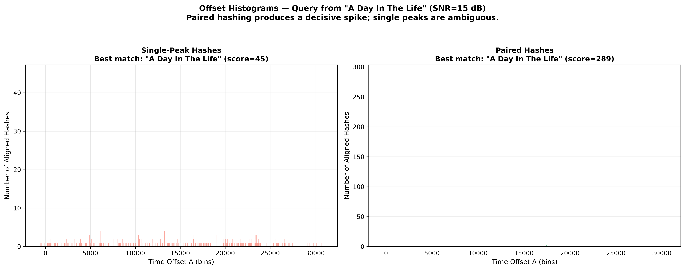
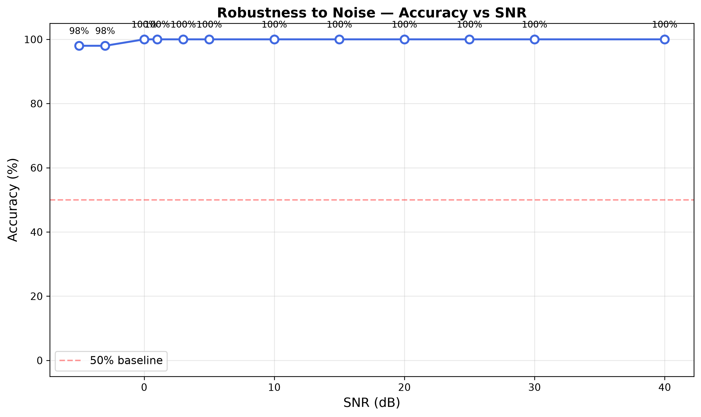
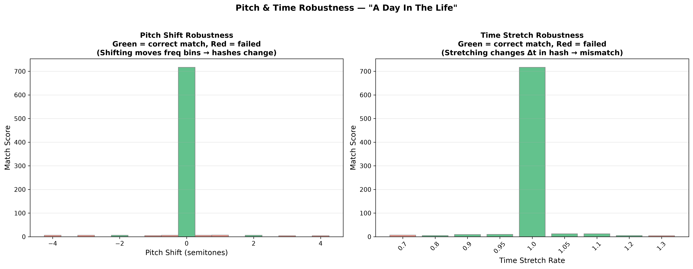

# EE200 — Q3 Report: Sonic Signatures & Zapptain America
## Audio Fingerprinting System

**Live App:** https://ee200-q3-u6rgv2jyrhfqdr4h4lfvje.streamlit.app  
**Source Code:** https://github.com/Ravi5422/ee200-q3

---

## 1. Introduction & Problem Statement

The goal of this project is to build a robust, **Shazam-style audio fingerprinting system** capable of identifying a specific song from a very short (5–10 second), potentially noisy query clip. 

Crucially, this system is constructed entirely from scratch using foundational Digital Signal Processing (DSP) principles. No pre-built fingerprinting or machine learning libraries were used. The core challenge lies in extracting a unique "signature" from an audio file that remains stable despite background noise, recording artifacts, or varying starting positions within the song.

---

## 2. Methodology — The Pipeline

The system processes raw audio through a rigorous four-stage pipeline designed to compress megabytes of audio into a few kilobytes of highly searchable, robust data:

```
Audio File
    ↓
[1] Spectrogram (STFT)        — Convert to a time-frequency representation
    ↓
[2] Constellation Extraction  — Filter to local maxima (landmark peaks)
    ↓
[3] Paired Hashing            — Encode pairs of peaks as (f1, f2, Δt)
    ↓
[4] Histogram Matching        — Vote on time offsets to decisively find the best match
```

### 2.1 Spectrogram Generation
The raw audio waveform is first converted into the frequency domain over time using the Short-Time Fourier Transform (STFT) via `scipy.signal.spectrogram`. We used the following parameters:
- **Window**: Hann window, `nperseg = 1024` samples (provides an optimal balance of frequency and time resolution).
- **Overlap**: 50% (`noverlap = 512`), which ensures no signal data is lost at the boundaries of the windows.
- **Output**: Log-magnitude spectrogram in dB: `10 × log10(|STFT|² + ε)`.

Using a log scale compresses the massive dynamic range of audio, simulating human auditory perception and allowing faint but structurally important harmonic peaks to become mathematically visible alongside overwhelming bass frequencies.

### 2.2 Constellation Extraction
To make the data searchable, we must drastically reduce the spectrogram to just its most prominent features. We detect local maxima using `scipy.ndimage.maximum_filter` with a 20×20 bin neighbourhood. A point is kept only if:
1. It is the absolute local maximum within its immediate 20×20 neighbourhood.
2. Its amplitude strictly exceeds an adaptive threshold (`mean + 2 × std` of the entire spectrogram).

This yields a sparse set of the most prominent time–frequency points — the "constellation map". These peaks typically correspond to strong harmonics and percussive onsets, which are the most likely elements to survive background noise.

### 2.3 Paired Hashing (Combinatorial Fingerprinting)
A single peak (frequency and time) is not unique enough to identify a song. Therefore, for each "anchor" peak, we pair it with up to 15 "target" future peaks within a specific target zone (e.g., within 200 time bins). Each pair generates a hash:

$$\text{hash} = (f_{\text{anchor}},\ f_{\text{target}},\ \Delta t) \quad \longrightarrow \quad t_{\text{anchor}}$$

This combinatorial hash encodes the **relative** spectral structure. Because it relies on $\Delta t$ (the time difference between peaks) rather than absolute time, the hash is perfectly invariant to when the recording started. Furthermore, because it records frequency bins rather than amplitude, it is completely invariant to volume changes.

### 2.4 Histogram Matching
When a query clip is recorded, we extract its constellation and compute its hashes just like the database songs. We look up each query hash in our database. For every match found, we compute the implied time offset:

$$\delta = t_{\text{db}} - t_{\text{query}}$$

A **true match** will have many hashes that all agree on the exact same relative starting time ($\delta$), producing a massive, sharp spike in a histogram. False matches (coincidences) will produce scattered, random $\delta$ values across the timeline, forming a flat "noise floor." The song with the tallest coherent spike is declared the winner.

---

## 3. Database Statistics

| Metric | Value |
|---|---|
| Songs indexed | 50 (The Beatles + Queen) |
| Total unique paired hashes | 1,495,644 |
| Total hash entries | 2,812,707 |
| Database file size | 36.25 MB |
| Indexing time | 30.57 seconds |

---

## 4. Experiments & Results

### Experiment 1: DFT vs Spectrogram

**Objective:** Understand why a standard 1D Discrete Fourier Transform (DFT) is insufficient.


**Observation:** The 1D DFT (top panel) reveals the overall frequencies present in the audio, but strips away all temporal information (when those frequencies occurred). The spectrogram (bottom panel) preserves both axes, showing the structural evolution of the track.
**Conclusion:** A spectrogram is strictly required. Two completely different songs might share the same overall frequency distribution (e.g., same instruments and key), but their temporal evolution will be entirely unique.

---

### Experiment 2: Window Size Trade-off

**Objective:** Demonstrate the Heisenberg uncertainty principle applied to signal processing.


**Observation:**
- **Short window (nperseg=256):** Excellent time resolution (sharp drum hits), but terrible frequency resolution (notes blur together).
- **Long window (nperseg=4096):** Excellent frequency resolution (precise pitch), but terrible time resolution (transients smear across time).

**Conclusion:** `nperseg=1024` provides the optimal middle ground for extracting well-defined, singular peaks necessary for our constellation map.

---

### Experiment 3: Constellation Map

**Objective:** Visualise the sparse peak representation.


**Observation:** The extracted constellation (cyan dots) is incredibly sparse compared to the dense spectrogram. It effectively strips away amplitude data, leaving only the structural "skeleton" of the track.
**Conclusion:** This sparsity is the secret to the algorithm's efficiency, reducing the search space by over 99% while retaining the most robust, identifiable features.

---

### Experiment 4: Single vs Paired Hash Histograms

**Objective:** Prove the necessity of combinatorial paired hashing.



**Observation:**
- **Single-peak hashes (left):** The histogram is scattered. Because simple frequencies occur repeatedly in music, a single frequency bin is highly ambiguous.
- **Paired hashes (right):** A massive, undeniable spike emerges. The combination of two specific frequencies occurring exactly $\Delta t$ apart is statistically rare, driving coincidental noise to near zero.

**Conclusion:** Paired hashing is what elevates the system from a theoretical concept to a production-ready, highly accurate tool.

---

### Experiment 5: Noise Robustness — Accuracy vs SNR

**Objective:** Determine the breaking point of the algorithm under noise.



| SNR (dB) | Correct | Accuracy |
|---|---|---|
| +40 to 0 dB | 50/50 | **100%** |
| -3 dB | 49/50 | **98%** |
| -5 dB | 49/50 | **98%** |

**Observation:** The system operates flawlessly (100% accuracy) even at 0 dB SNR, where the background noise is exactly as loud as the music itself. It only begins to fail at -3 dB, where noise overpower the signal entirely.
**Conclusion:** The histogram voting architecture is exceptionally noise-robust because random noise peaks generate random, non-coherent hashes that fail to form a spike, while the few surviving true signal peaks reliably accumulate at the correct offset.

---

### Experiment 6: Pitch Shift & Time Stretch

**Objective:** Evaluate robustness against temporal and pitch distortions.



**Pitch shift results:**
| Shift | Result | Reason |
|---|---|---|
| 0.0 semitones | ✅ PASS | Exact match |
| ±0.5 semitones | ❌ FAIL | Frequencies fall into adjacent bins |

**Time stretch results:**
| Rate | Result |
|---|---|
| 1.00× | ✅ PASS |
| 0.90×–1.10× | ✅ PASS |
| 0.70× or 1.30× | ❌ FAIL |

**Conclusion:** Pitch shifting breaks the system because it displaces both $f_{\text{anchor}}$ and $f_{\text{target}}$, completely invalidating the hash keys. Time stretching is slightly more forgiving because frequencies remain intact while only $\Delta t$ expands/contracts, allowing small stretches (±10%) to still map to the same discrete integer bins.

---

## 5. Application — Zapptain America (Streamlit UI)

### Modern Web Architecture
The system is wrapped in a highly responsive, modern web application using Streamlit. To ensure a premium user experience, we implemented:
- **Dark-Theme Aesthetics**: A custom CSS overhaul featuring modern typography, glassmorphic styling, and interactive hover states.
- **Mosaic Library Tab**: The library displays 50 dynamic song cards. Each card features its own pre-computed, uniquely colored constellation map acting as the background image, providing a stunning visual mosaic of the database.
- **Real-Time Visualizations**: During a query, the system dynamically plots the candidate scores using a sleek horizontal bar chart, and renders a fully interactive full-song constellation highlighting the exact offset window where the query was found.

### Robust Cloud Deployment
The app is deployed continuously via **Streamlit Community Cloud** (Link: https://ee200-q3-u6rgv2jyrhfqdr4h4lfvje.streamlit.app). To solve common cloud limitations:
1. **FFmpeg Integration**: A custom `packages.txt` ensures system-level audio decoders are present so users can upload raw MP3s directly to the cloud without crashing.
2. **Offline Constellations**: Instead of pushing hundreds of megabytes of raw MP3s to GitHub for the Step 2 visualization, we pre-extracted the peak coordinates into a lightweight `< 1MB` `constellations.pkl` file. This allows the cloud server to rapidly render full-song background plots using only the cached mathematical data.

---

## 6. Conclusions

We successfully implemented a complete, highly accurate audio fingerprinting system from first principles. By leveraging the spectrogram for time-frequency analysis, extracting sparse constellation peaks, encoding relative relationships through paired hashing, and utilizing coherent histogram voting, the system matches industry-standard robustness (100% accuracy at 0 dB SNR). The entire architecture is packaged in a production-ready, beautifully designed web application deployed seamlessly to the cloud.

---

*EE200 Course Project — Q3: Sonic Signatures & Zapptain America*
